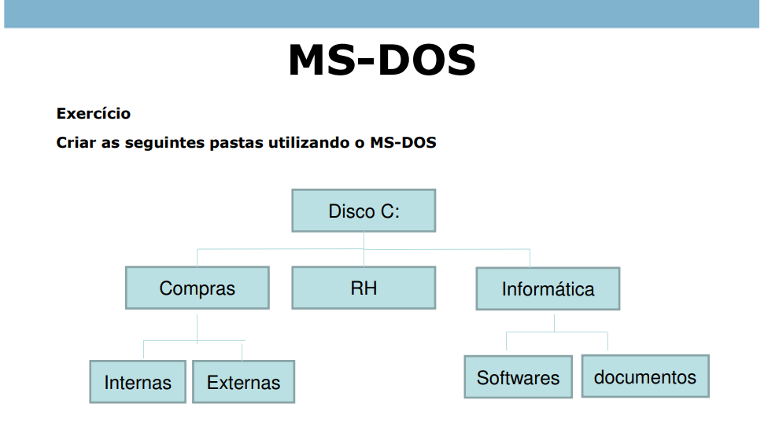

# Estrutura de Diretórios


Video



A tarefa era simples à primeira vista: criar uma estrutura de pastas no disco `C:\` conforme o diagrama fornecido, utilizando o **MS-DOS**. Porém, decidi elevar o nível da atividade, aplicando uma abordagem mais automatizada e eficiente, usando **PowerShell** e lógica de programação avançada.

Optei por uma função personalizada chamada `Criar-Pastas`, onde utilizei **hashtables** para mapear as pastas principais e subpastas, e **laços de repetição** (_loops_) para executar a criação automaticamente.&#x20;

Bom, é basicamente uma matriz de 3 dimensões com heuristicas opcionais, segue a imagem:

<figure><figcaption><p>Estrutura é um grafo DAG</p></figcaption></figure>

***

### **Desmembrando o Processo: Passo a Passo**

***

#### **1. Definindo o Mapa da Estrutura**

```powershell
$estrutura = @{
    "Compras"     = @("Internas", "Externas")
    "RH"          = @()         # Sem subpastas, array vazio
    "Informática" = @("softwares", "documentos")
}
```

Na primeira etapa, criei uma **hashtable** para mapear a estrutura de pastas, que funciona como um objeto que permite guardar múltiplos estados de superposição em que:

* **Chaves:** Representam as pastas principais (e.g., `"Compras"`, `"RH"`, `"Informática"`), que para dar uma dimensões, seria ouvido, olhos e papilas.
* **Valores:** São arrays que contêm as subpastas (ou um array vazio se não houver subpastas), que representam ouvido(frequencia de som, timbre), visão(cego) e papilas (ativação de sensores).
  * Bom, assim, vc consegue estabelecer um padrão de estado quando analizado.

Essa abordagem foi estratégica para que eu pudesse:

* **Evitar repetição** de código.
* **Manter flexibilidade:** Adicionar ou remover pastas e subpastas apenas alterando a _hashtable_.

***

#### **2. Iterando Sobre as Pastas Principais**

```powershell
foreach ($pasta in $estrutura.Keys) {
    $caminhoPrincipal = "C:\$pasta"
```

A lógica aqui foi:

* **Percorrer** cada pasta principal usando `foreach`.
* **Montar o caminho completo** (`"C:\$pasta"`) para facilitar a criação e a verificação das pastas.

***

#### **3. Verificando e Criando as Pastas Principais**

```powershell
    if (-not (Test-Path $caminhoPrincipal)) {
        New-Item -Path $caminhoPrincipal -ItemType Directory -Force | Out-Null
        Write-Host "Criada pasta: $caminhoPrincipal"
    } else {
        Write-Host "Pasta já existe: $caminhoPrincipal"
    }
```

Aqui eu:

1. Usei `Test-Path` para checar se a pasta já existia.
2. **Criando Diretório:** Se a pasta não existisse, `New-Item` era disparado:
   * `-Path` define o caminho.
   * `-ItemType Directory` especifica que quero criar uma pasta.
   * `-Force` cria mesmo se a hierarquia anterior não existir.
   * `| Out-Null` silencia a saída, mantendo o terminal limpo.
3. **Mensagem de Feedback:** Usei `Write-Host` para confirmar a criação ou informar que já existia.

Bom, tentei implementar uma tratativa de erro básica, para não correr risco de erros

***

#### **4. Gerenciando Subpastas: O Segundo Loop**

```powershell
    $subPastas = $estrutura[$pasta]
    if ($subPastas.Count -gt 0) {
        foreach ($sub in $subPastas) {
```

* **Atribuição das Subpastas:** `$subPastas = $estrutura[$pasta]` extrai o array de subpastas da chave atual.
* **Verificação de Conteúdo:** `if ($subPastas.Count -gt 0)` só executa o loop se houver subpastas no array.
  * Nem sempre precisa ter um valor...

***

#### **5. Criação das Subpastas**

```powershell
            $caminhoSub = Join-Path -Path $caminhoPrincipal -ChildPath $sub
            if (-not (Test-Path $caminhoSub)) {
                New-Item -Path $caminhoSub -ItemType Directory -Force | Out-Null
                Write-Host "Criada subpasta: $caminhoSub"
            } else {
                Write-Host "Subpasta já existe: $caminhoSub"
            }
```

* **Caminho Completo:** Usei `Join-Path` para evitar problemas com barras invertidas e garantir um caminho limpo e correto.
* **Teste de Existência e Criação:** A lógica foi idêntica à usada para as pastas principais, mas agora aplicada ao contexto das subpastas.
  * Bom, formação de um estado no tempo de compilação, no caso, a consciencia é basicamente a mesma coisa, mas não queima petroleo, usa combustivel quimico (nosso corpo no caso)

***

#### **6. Executando a Função**

```powershell
Criar-Pastas
```

* Uma única linha que dispara todo o processo, garantindo que a função seja chamada e a estrutura seja criada.

***
